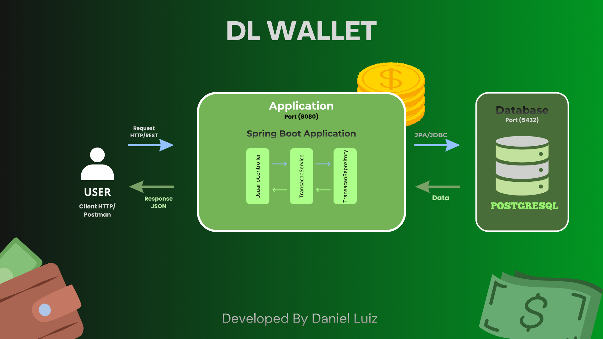

# DL Wallet - Gerenciador Financeiro Pessoal

<div align="center">


</div>

##  Visão Geral - O Problema Real

Muitas pessoas perdem o controle de suas finanças por não terem uma forma simples e centralizada de registrar entradas e saídas. O **DL Wallet** resolve o problema da falta de visibilidade financeira, permitindo que o usuário tenha um histórico claro de suas transações e, futuramente, uma visão consolidada de seu saldo acumulado.

---
## Arquitetura do Sistema
Para garantir a escalabilidade e o isolamento do ambiente, o  projeto segue uma estrutura de **Monolito Containerizado**, dividida em camadas para facilitar a manutenção, o **DL Wallet** foi desenhado para um melhor entendimento conforme o fluxo abaixo:
<div align="center">
  
</div>

1.  **Client/User**: Interface que consome a API (Postman, Frontend ou Mobile).
2.  **Controller**: Camada de entrada que gerencia as requisições REST.
3.  **Service**: Onde reside a inteligência do negócio (regras de cálculo e validações).
4.  **Repository**: Interface de comunicação com o banco de dados via JPA/Hibernate.
5.  **PostgreSQL**: Banco de dados relacional rodando em um container isolado.

---

## Tecnologias Utilizadas
* **Java 21** & **Spring Boot 4**
* **Spring Data JPA**: Persistência de dados eficiente.
* **PostgreSQL**: Banco de dados robusto para produção.
* **Docker & Docker Compose**: Orquestração do ambiente de desenvolvimento.
* **Bean Validation**: Validação rigorosa dos dados de entrada.
* **Maven**: Gerenciamento de dependências e build.

---

## Endpoints da API

Abaixo estão os principais pontos de acesso da aplicação:

### Usuários
| Método | Endpoint | Descrição |
| :--- | :--- | :--- |
| `POST` | `/usuarios` | Cadastra um novo usuário no sistema. |
| `GET` | `/usuarios/{id}` | Busca detalhes de um usuário específico. |

### Transações
| Método | Endpoint | Descrição |
| :--- | :--- | :--- |
| `POST` | `/transacoes` | Registra uma nova entrada ou saída financeira. |
| `GET` | `/transacoes/usuario/{id}` | Lista todo o histórico financeiro de um usuário. |
| `DELETE` | `/transacoes/{id}` | Remove um registro de transação. |

> **Nota:** Você pode acessar a documentação completa via Swagger em: `http://localhost:8080/swagger-ui/index.html`

---

## Como Executar o Projeto

Você precisará ter o **Docker Desktop** instalado na sua máquina.

1.  **Clone o projeto:**
    ```bash
    git clone [https://github.com/DLzada/dl-wallet.git](https://github.com/DLzada/dl-wallet.git)
    cd dl-wallet
    ```

2.  **Gere o pacote do Java:**
    ```bash
    mvn clean package -DskipTests
    ```

3.  **Suba os Containers:**
    ```bash
    docker compose up --build
    ```

O Spring Boot iniciará na porta `8080` e o Postgres na porta `5432`.

---
##  Autor
Desenvolvido por **Daniel Luiz**.

* [LinkedIn](https://www.linkedin.com/in/daniel-luiz1607)